## Overview

A comprehensive deep learning pipeline for detecting, localizing, and recognizing handwritten mathematical expressions. This was developed as the final project for the Machine Learning course at the **University of Tehran** (ECE Department).

The system tackles the problem in three stages:
1.  **Detection:** Locating characters in the image.
2.  **Clustering:** Grouping characters to understand structure.
3.  **Recognition:** Translating the visual features into a LaTeX-like string.

## Methodology

### 1. Character Detection & Localization
I implemented and compared two state-of-the-art object detection models:
*   **YOLOv8:** Optimized for real-time performance.
*   **Faster R-CNN:** Prioritized for higher precision localization.

### 2. Character Clustering
To analyze the spatial relationships between characters, I applied unsupervised learning techniques:
*   **Algorithms:** K-Means, DBSCAN, and Hierarchical Clustering.
*   **Feature Extraction:** Used HOG (Histogram of Oriented Gradients) and CNN-based features to group similar characters.

### 3. Expression Recognition (CRNN)
The core recognition engine is a **CRNN (Convolutional Recurrent Neural Network)** trained with **CTC (Connectionist Temporal Classification)** loss. This architecture allows the model to read the expression from left to right without requiring segmented character labels.

*   **Supervised Learning:** Trained on the base dataset.
*   **Semi-Supervised Learning:** Enhanced performance by using pseudo-labeling on the test set to iteratively improve the model.

## Results

| Model | Task | Metric | Score |
|-------|------|--------|-------|
| **YOLOv8** | Character Detection | mAP | **92.3%** |
| **Faster R-CNN** | Localization | mAP | 89.7% |
| **Supervised CRNN** | Expression Rec. | Accuracy | 54.35% |
| **Semi-Supervised CRNN** | Expression Rec. | Accuracy | **~60.0%** |

*Note: The semi-supervised approach significantly improved recognition by leveraging unlabelled test data.*

## Pipeline

```mermaid
graph LR
    A[Input Image] --> B[YOLOv8 / Faster R-CNN]
    B --> C{Character Features}
    C --> D[Unsupervised Clustering]
    C --> E[CRNN + CTC Loss]
    E --> F[Semi-Supervised Loop]
    F --> G[Final LaTeX Output]
```

## Key Technologies
*   **PyTorch** for all model implementations.
*   **YOLOv8** & **Faster R-CNN** for object detection.
*   **CRNN** with **ResNet50** backbone for sequence recognition.
*   **Scikit-Learn** for clustering and data analysis.

## Code

Full implementation and training scripts are available on [GitHub →](https://github.com/ahmadrezafarvardin/ML-finalProject-UT)