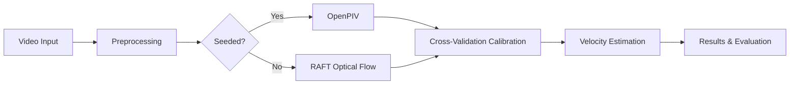

## Overview

A hybrid pipeline for estimating river surface velocities from video footage, combining state-of-the-art deep learning optical flow with classical Particle Image Velocimetry (PIV). This research project was conducted to develop an automated, robust system capable of handling diverse real-world river conditions.

The system integrates two complementary approaches:
1.  **RAFT (Recurrent All-Pairs Field Transforms):** A pre-trained CNN for estimating optical flow in unseeded or thermal videos.
2.  **OpenPIV:** A classical cross-correlation method for analyzing seeded flows with visible particles.

## Methodology

### 1. Video Preprocessing
The pipeline begins by loading video footage and applying necessary preprocessing steps:
*   **Resolution Normalization:** All videos are resized to a consistent target resolution (configurable in `config.py`).
*   **Frame Sampling:** To manage computational cost, a maximum number of frames per video is defined.
*   **FPS Correction:** Manual overrides are applied to correct metadata errors in video files, ensuring accurate velocity calculations.

### 2. Flow Estimation
The core estimation is performed using two distinct methods, chosen based on the video characteristics:
*   **RAFT Optical Flow:** For videos without visible particles (unseeded), RAFT is used to estimate pixel-wise motion between consecutive frames. This deep learning model excels at capturing subtle flow patterns.
*   **OpenPIV Cross-Correlation:** For videos with visible seeding particles, OpenPIV is employed. It divides the image into small interrogation windows and uses cross-correlation to track particle movement between frames.

### 3. Calibration and Validation
A critical component of the pipeline is the calibration process, which bridges the gap between pixel motion and real-world velocity.
*   **Cross-Validation Calibration:** A cross-validation approach was implemented to calibrate the system for different camera setups and river conditions.
*   **Challenge:** The project highlighted the significant impact of accurate calibration data. The lack of sufficient ground-truth calibration points for some videos posed a challenge, affecting the precision of the final velocity measurements. However, this limitation provided a valuable learning experience in understanding the practical complexities of real-world computer vision systems.

## Results

The hybrid pipeline was evaluated on 22 real-world river videos with varying conditions.

| Metric | Value |
|--------|-------|
| **R² Score** | 0.77 |
| **MAE** | 0.36 m/s |
| **RMSE** | 0.58 m/s |
| **Videos** | 22 |

## Pipeline Overview

## Key Technologies
*   **PyTorch** for deep learning model implementation.
*   **RAFT (Princeton Vision Group)** for optical flow estimation.
*   **OpenPIV** for classical cross-correlation PIV.
*   **OpenCV** & **NumPy** for image processing and numerical operations.

## Code

Full implementation, including the pipeline orchestrator and configuration files, is available on [GitHub →](https://github.com/ahmadrezafarvardin/river_velocity_estimation)
